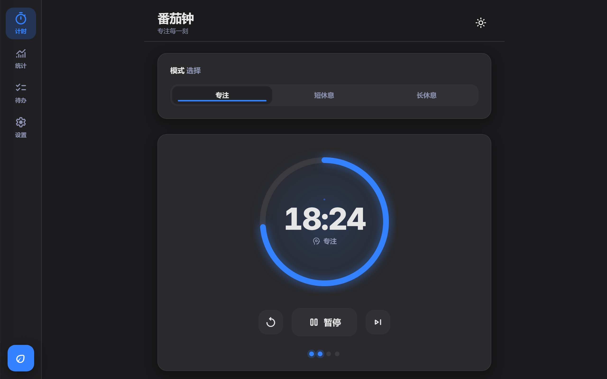
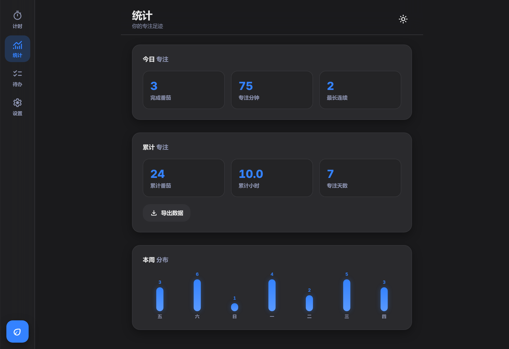
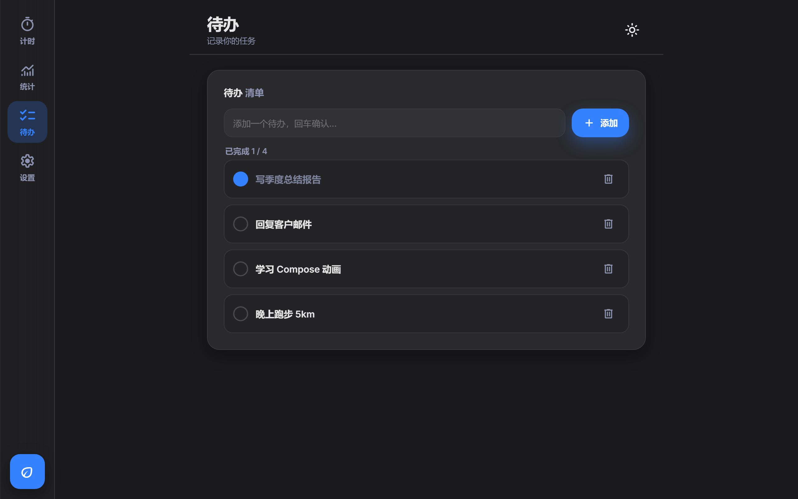
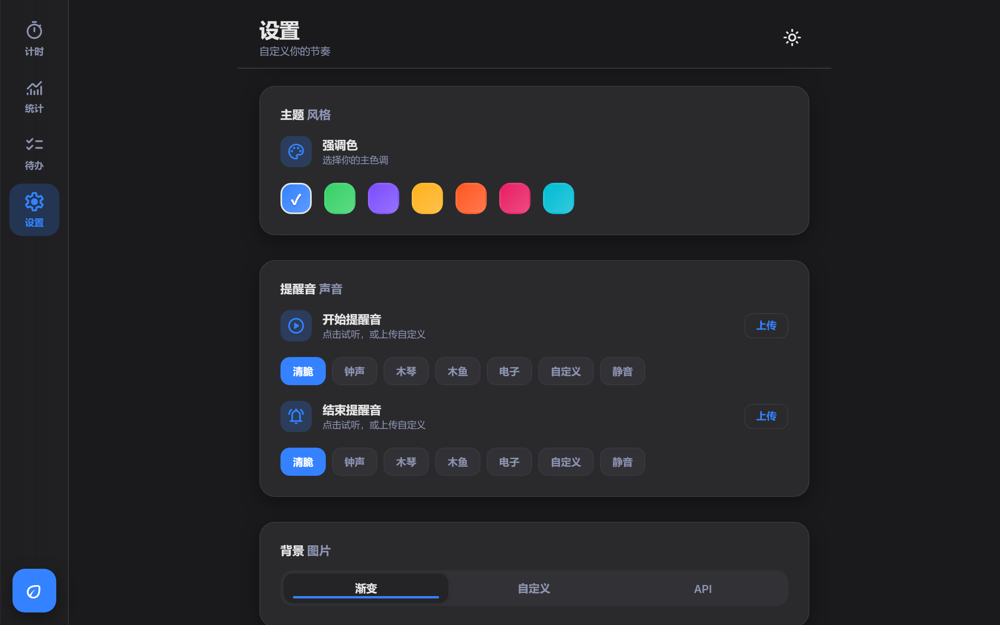
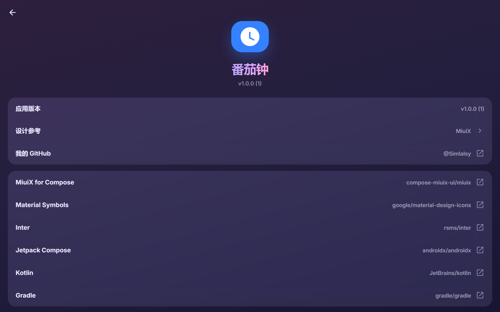
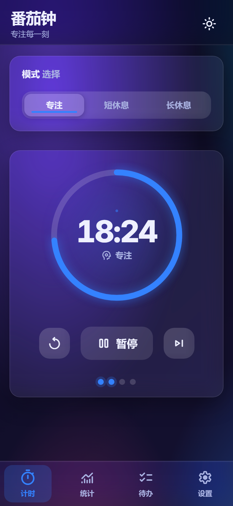
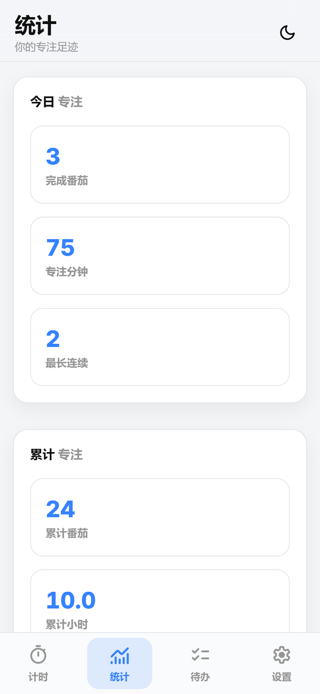

# 番茄钟 · Miuix

[English](README.md) | 简体中文

一个 MIUI / HyperOS（**Miuix**）风格的番茄钟 —— 毛玻璃、弹簧动效、MIUI 拉伸回弹。

- **网页版** —— 单个零依赖的 `index.html`，打开即用。
- **安卓版** —— 用 WebView 原样运行同一份网页（像素级一致），并由原生前台服务兜底：息屏/锁屏也能准确计时、常驻通知栏倒计时、原生提示音（含自定义上传）等。

|               计时 · 深色                |                统计                 |                    待办                     |
| :--------------------------------------: | :---------------------------------: | :-----------------------------------------: |
|  |  |          |
|                 **设置**                 |              **关于**               |               **手机 · 极光**               |
|    |  |  |

<p align="center">
  
</p>

## 功能

- **计时** —— 专注 / 短休息 / 长休息；时长可调；长休息间隔；自动开始下一轮；跳过与重置；每轮进度圆点。
- **主题** —— 跟随系统 / 浅色 / 深色 / 极光，7 种强调色；毛玻璃卡片、页面转场与弹簧曲线；滚动到边界的 MIUI 拉伸回弹。
- **锁屏继续计时（安卓）** —— 前台服务保证息屏后倒计时不丢；通知栏显示剩余时间，并提供 暂停 / 停止 / 跳过 按钮（指令回传网页执行）。
- **提示音** —— 内置 5 种音色（清脆 / 钟声 / 木琴 / 木鱼 / 电子），支持上传自定义音频；开始音与结束音可分别设置。自定义音频限时 10 秒并以渐弱收尾。
- **统计** —— 今日 / 累计 / 本周分布，一键导出 JSON。
- **待办** —— 轻量清单，支持勾选与删除。
- **背景** —— 渐变、图片链接、本地上传，或从公共 API 随机换图（每 5 分钟自动刷新）。
- **关于页** —— 版本、作者 GitHub 与全部开源组件，点击即跳转。

## 快速开始

### 网页版

```bash
# 无需构建、无需依赖，直接打开：
start index.html          # Windows
open index.html           # macOS
```

首次打开会从 Google Fonts 拉取 _Inter_ 与 _Material Symbols_ 字体；无网络时页面仍可用，但图标会退化为文字。安卓版已把两款字体打进 App，不依赖网络。

### 安卓版

```bash
cd android
./gradlew assembleDebug     # 产物：app/build/outputs/apk/debug/app-debug.apk
./gradlew installDebug      # 连接设备后直接安装
```

- 需要 JDK 17+ 与 Android SDK（compileSdk 37）。`local.properties` 里的 `sdk.dir` 指向本机 SDK，换机器请改写或删除该文件由 IDE 生成。
- 整个 App 就是网页跑在 WebView 里（`WebApp.kt`）。工程内还附带一套 100% 原生的 [Miuix](https://github.com/compose-miuix-ui/miuix) Compose 实现，改一个开关即可切换 —— 详见 [`android/README.md`](android/README.md)。
- `android/tools/gen_tones.py` 用于重新生成内置提示音 WAV（纯标准库；改参数后重跑即可）。

## 实现要点

- **单一数据源** —— Gradle 任务 `syncWebAssets` 在构建时把 `../index.html` 同步进 `app/src/main/assets/`，不存在需要手工维护的第二份副本。
- **稳定的源** —— 页面经 `https://appassets.androidplatform.net/` 由 `shouldInterceptRequest` 提供，给页面一个正常的 https 源，`localStorage`（设置 / 统计 / 待办）才能稳定持久化。
- **原生桥**（`WebApp.kt`，注入为 `window.MiuixBridge`）—— 文件选择器、导出 JSON 到「下载」目录、提示音上传、外链跳系统浏览器、计时状态同步给前台服务。
- **沉浸式与主题** —— 系统栏高度以 `--safe-top` / `--safe-bottom` 注入页面；`MutationObserver` 监听页面主题并同步系统栏图标颜色。

## 目录结构

```
index.html                  网页版 —— HTML + CSS + JS 全内联
docs/screenshots/           本 README 使用的截图
android/                    安卓壳（Kotlin + WebView + 前台服务）
├── app/src/main/java/com/miuix/pomodoro/
│   ├── WebApp.kt           WebView 宿主 + JS 桥
│   ├── PomodoroService.kt  前台服务：锁屏计时、通知栏
│   ├── Tones.kt            SoundPool / MediaPlayer 提示音
│   └── ui/                 可切换的原生 Miuix（Compose）实现
└── tools/gen_tones.py      生成 res/raw/tone_*.wav
```

## 开源组件

| 组件                                                                | 用途               | 许可        |
| ------------------------------------------------------------------- | ------------------ | ----------- |
| [Miuix for Compose](https://github.com/compose-miuix-ui/miuix)      | 设计参考与原生界面 | Apache-2.0  |
| [Material Symbols](https://github.com/google/material-design-icons) | 图标字体           | Apache-2.0  |
| [Inter](https://github.com/rsms/inter)                              | 数字与西文字体     | SIL OFL 1.1 |
| [Jetpack Compose](https://github.com/androidx/androidx)             | Android UI 框架    | Apache-2.0  |
| [Kotlin](https://github.com/JetBrains/kotlin)                       | 开发语言           | Apache-2.0  |
| [Gradle](https://github.com/gradle/gradle)                          | 构建系统           | Apache-2.0  |

## 许可

[Apache License 2.0](LICENSE) © 2026 [Simlalsy](https://github.com/Simlalsy)
